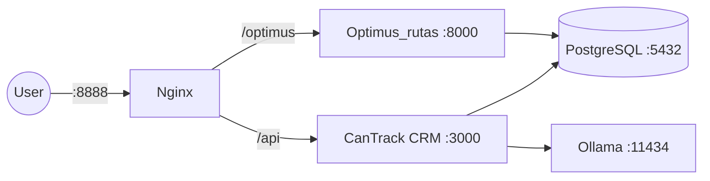

# Deployment Architecture

## Overview

The system runs in Docker containers on a VPS (187.124.237.242). Three main services plus external database.

## Services

| Service | Port | Technology | Purpose |
|---|---|---|---|
| **CanTrack CRM** | `:3000` | Node.js + Express + React | Main application |
| **Optimus_rutas** | `:8000` | Python FastAPI | Route optimization |
| **Ollama** | `:11434` | LLM server | Local AI fallback |
| **Nginx** | `:8888` | Reverse proxy | SSL termination, routing |
| **PostgreSQL** | `:5432` | Database (CasaOS-managed) | Data persistence |

## Docker Compose

File: `docker-compose.yml`

```yaml
services:
  app:        # CanTrack CRM
    build: .
    ports: ["3000:3000"]
    depends_on: [optimus-rutas]
    networks: [cantrack-network, postgresql_default]

  optimus-rutas:  # Route optimization microservice
    build: ./Optimus_rutas
    ports: ["8000:8000"]
    networks: [cantrack-network, postgresql_default]

  ollama:     # Local LLM
    image: ollama/ollama:latest
    ports: ["11434:11434"]
    volumes: [ollama-data:/root/.ollama]
    networks: [cantrack-network]
```

## Nginx Configuration

File: `nginx.conf`

Routes:
- `/` → CanTrack CRM (`:3000`)
- `/api` → CanTrack CRM backend (`:3000`)
- `/optimus` → Optimus_rutas (`:8000`)

## Network Architecture



## Environment Variables

See `.env.example` for all required variables. Key categories:
- `DATABASE_URL` — PostgreSQL connection string
- `JWT_SECRET` — Token signing secret (min 32 chars)
- `GEMINI_API_KEY` / `GROQ_API_KEY` — AI enrichment
- `MDIRECTOR_*` — Email marketing credentials
- `MAPBOX_TOKEN` — Geocoding and routing
- `WEBHOOK_SECRET` — Scraper integration
