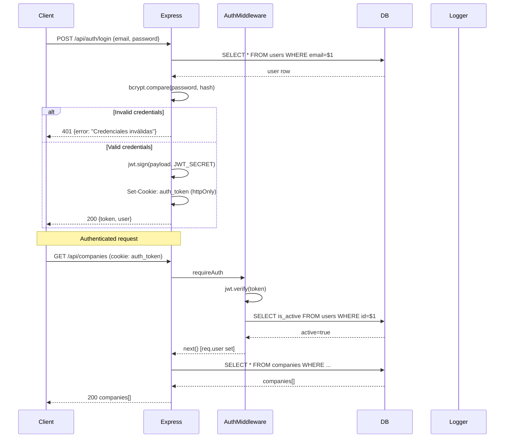
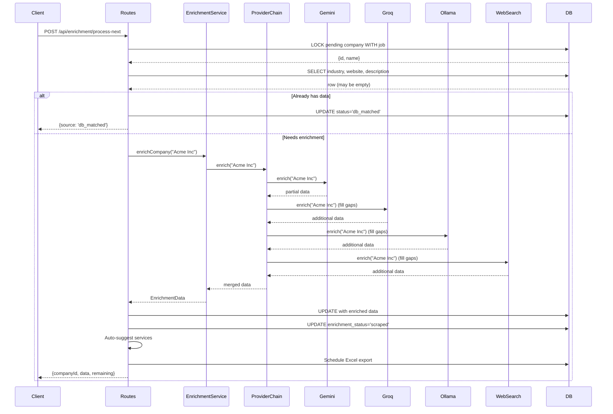
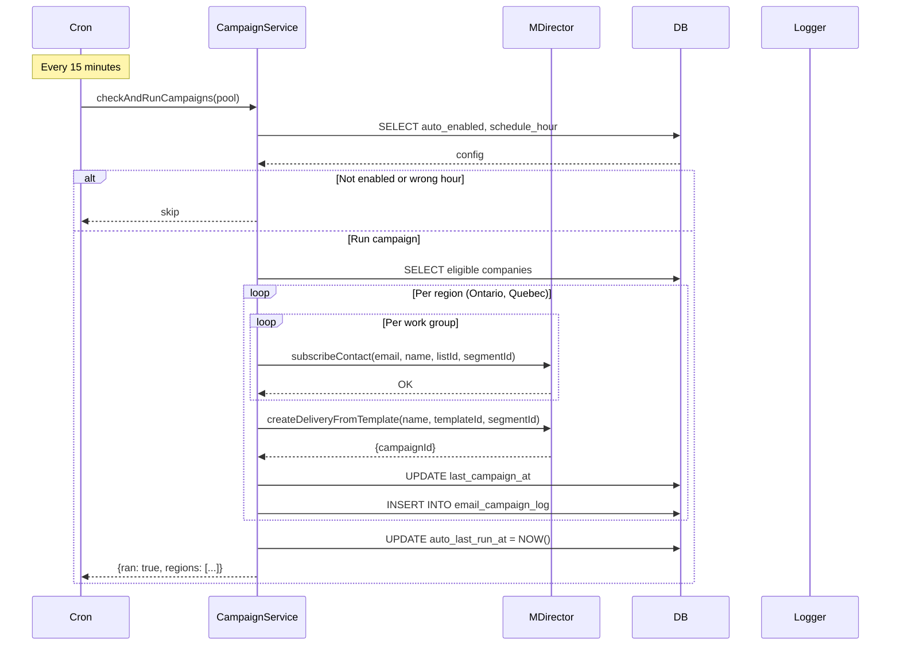
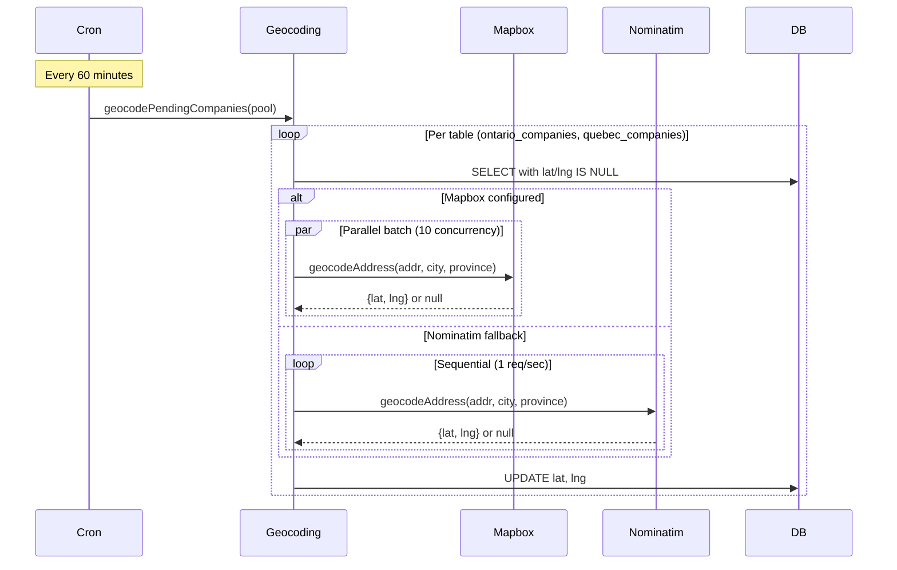
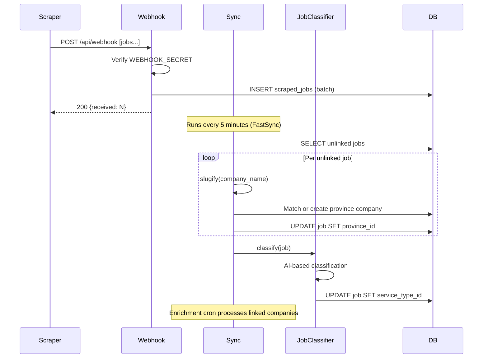
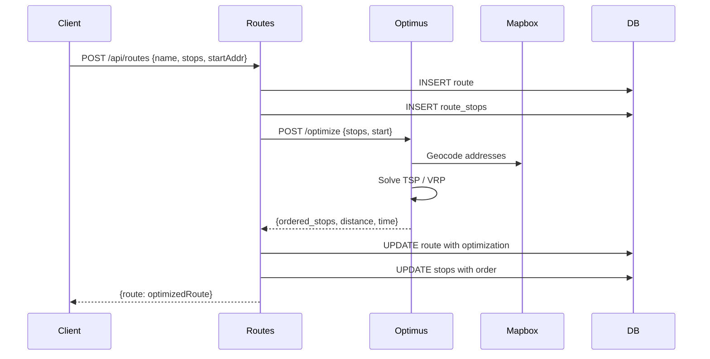
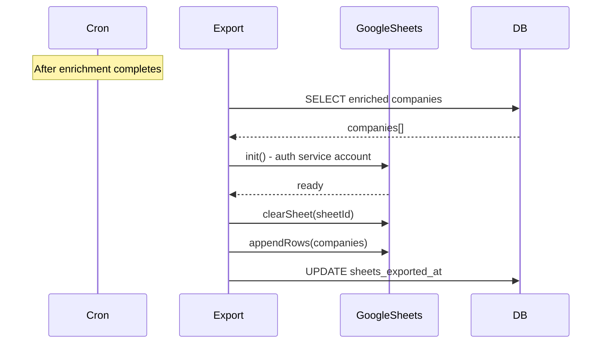

# Sequence Diagrams

## Authentication Flow

## Company Enrichment Flow

## Campaign Automation Flow

## Geocoding Flow

## Webhook Data Ingestion Flow

## Route Planning Flow

## Export to Google Sheets Flow

