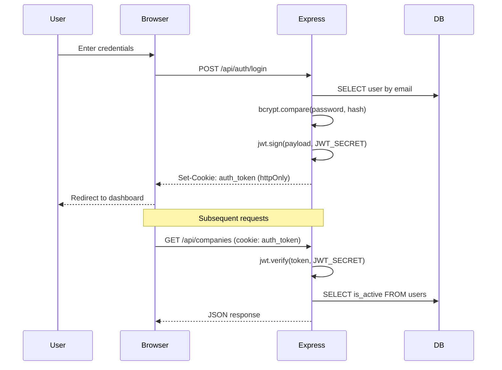

# Authentication & Authorization

## Overview

JWT-based authentication with httpOnly cookies and optional Bearer header. Users have role-based access control.

## Authentication Flow



## Implementation

| File | Responsibility |
|---|---|
| `server/middleware/auth.middleware.ts` | JWT extraction, verification, user active check |
| `server/utils/auth-helpers.ts` | Token signing, cookie setting, user sanitization |
| `server/lib/config.ts` | JWT secret, expiry, cookie max age |
| `src/contexts/AuthContext.tsx` | Frontend auth state management |
| `src/services/apiClient.ts` | Cookie-based HTTP client |

## Token Details

- **Algorithm**: HS256
- **Expiry**: 8 hours (configurable via `jwt.expiresIn`)
- **Storage**: httpOnly cookie named `auth_token`
- **Fallback**: Bearer token in `Authorization` header

## Roles

| Role | Permissions |
|---|---|
| `admin` | Full access: create/edit/delete users, companies, campaigns |
| `editor` | Can create/edit companies, send campaigns, enrich data |
| `viewer` | Read-only access |

## Rate Limiting

| Endpoint | Limit | Window |
|---|---|---|
| `/api/auth/login` | 10 attempts | 15 min |
| `/api/auth/password` | 5 attempts | 15 min |
| `/api/auth/setup` | 3 attempts | 1 hour |
| `/api/` (general) | 60 requests | 1 min |
| `/api/routes/create-batch` | 10 requests | 1 hour |
| `/api/webhook` | 10 requests | 1 hour |
| `/api/agent/` | 120 requests | 1 min |

## Setup Flow

1. First startup: no users exist → `GET /api/auth/setup` creates initial admin
2. Subsequent startups: redirect to login
3. If all users deactivated: database reset required

## Security Headers

Configured via `helmet` middleware:

```typescript
app.use(helmet({
  hsts: { maxAge: 31536000, includeSubDomains: true, preload: true },
  contentSecurityPolicy: false, // Disabled for SPA
}));
```
