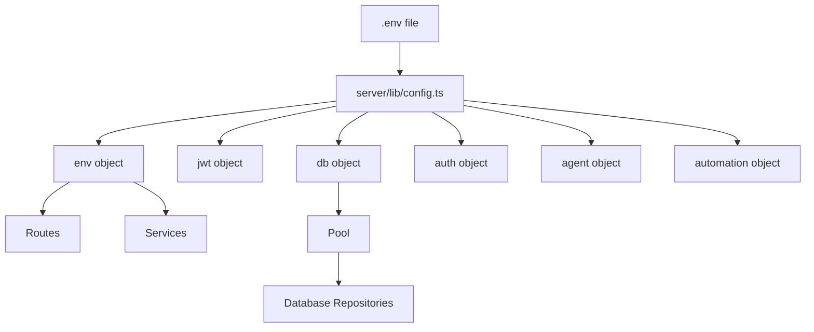

# Configuration

## Environment Variables

File: `.env` (copy from `.env.example`)

### Server

| Variable | Required | Default | Description |
|---|---|---|---|
| `PORT` | No | `3000` | Express server port |
| `ALLOWED_ORIGINS` | No | `http://localhost:5173,http://localhost:3000` | CORS origins |
| `NODE_ENV` | No | `development` | Environment mode |

### Security

| Variable | Required | Default | Description |
|---|---|---|---|
| `JWT_SECRET` | **Yes** | — | Min 32 chars, used for token signing |
| `WEBHOOK_SECRET` | **Yes** | — | Shared secret with scrapers |
| `COOKIE_SECURE` | No | `true` | Set `false` for local dev over HTTP |

### Database

| Variable | Required | Default | Description |
|---|---|---|---|
| `DATABASE_URL` | **Yes** | — | PostgreSQL connection string |

### AI Enrichment

| Variable | Required | Default | Description |
|---|---|---|---|
| `GEMINI_API_KEY` | No | — | Google Gemini AI key |
| `GROQ_API_KEY` | No | — | Groq API key |
| `GROQ_MODEL` | No | `llama-3.1-8b-instant` | Groq model |
| `OLLAMA_BASE_URL` | No | `http://localhost:11434` | Ollama server URL |
| `OLLAMA_MODEL` | No | `llama3.2` | Ollama model |

### Email (MDirector)

| Variable | Required | Default | Description |
|---|---|---|---|
| `MDIRECTOR_USERNAME` | No | — | MDirector account username |
| `MDIRECTOR_PASSWORD` | No | — | MDirector account password |
| `MDIRECTOR_FROM_EMAIL` | No | — | Sender email |
| `MDIRECTOR_FROM_NAME` | No | `CanTrack Staffing` | Sender name |

### Geocoding & Routing

| Variable | Required | Default | Description |
|---|---|---|---|
| `MAPBOX_TOKEN` | No | — | Mapbox access token |
| `OPTIMUS_URL` | No | `http://optimus-rutas:8000` | Optimus_rutas service URL |

### Google Sheets

| Variable | Required | Default | Description |
|---|---|---|---|
| `ONTARIO_SHEETS_ID` | No | — | Google Sheet ID for Ontario |
| `QUEBEC_SHEETS_ID` | No | — | Google Sheet ID for Quebec |
| `GOOGLE_SERVICE_ACCOUNT_CREDENTIALS` | No | — | Service account JSON |

### Automation

| Variable | Required | Default | Description |
|---|---|---|---|
| `AUTOMATION_SUBMIT_ENABLED` | No | `false` | Enable Playwright form submissions |
| `REGION_FILTER` | No | — | Filter to specific region |
| `AGENT_SKIP_HOURS` | No | — | Skip automation during certain hours |

## Configuration Architecture

File: `server/lib/config.ts` — Centralized config with validation.
