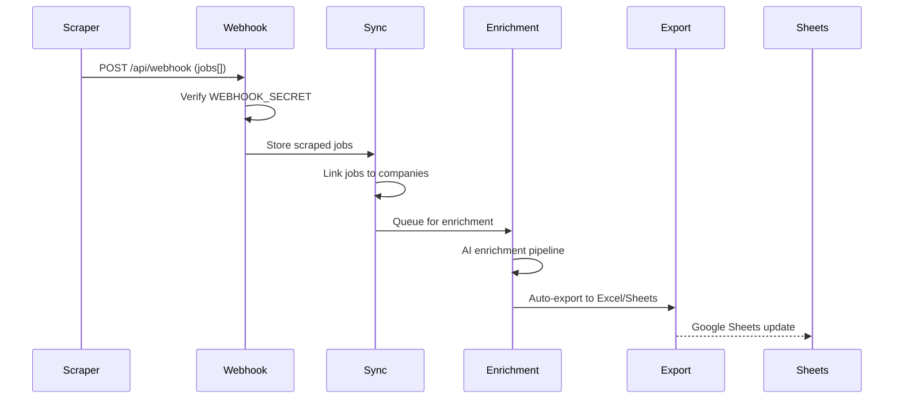

# Scraping & Data Ingestion

## Overview

CanTrack ingests job data via two mechanisms: **webhooks** (from external scrapers) and **Playwright** (automated form submissions).

## Data Flow

## Webhook Integration

- Endpoint: `POST /api/webhook` (file: `server/routes/webhook.routes.ts`)
- Authentication: `WEBHOOK_SECRET` header match
- Payload: JSON array of job objects
- Source detection: automatic (greenhouse, lever, etc.)

## Portal Detection

File: `server/services/portal-detector.ts`

Automatically detects the ATS (Applicant Tracking System) from job URLs:
- Greenhouse
- Lever
- Workday
- BambooHR
- etc.

## Job Classifier

File: `server/services/job-classifier.service.ts`

Classifies jobs into service types using AI. Matches job titles/descriptions to predefined service categories.

## Playwright Automation

File: `server/services/automation.service.ts`

- Controlled by `AUTOMATION_SUBMIT_ENABLED` env var
- Submits applications via headless Chromium
- Takes screenshots of submissions
- Requires system dependencies (libnss3, libxss1, etc.) — installed in Dockerfile
