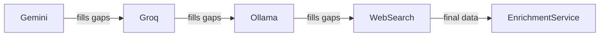

# Services Layer

Business services that encapsulate external integrations, AI provider chains, and complex business logic.

## External Integrations

| Service | File | External API | Purpose |
|---|---|---|---|
| MDirector | `mdirector.service.ts` | MDirector API | Email marketing campaigns |
| Google Sheets | `google-sheets.service.ts` | Google Sheets API | Data export to spreadsheets |
| Gemini | `gemini.service.ts` | Google Gemini AI | Primary company enrichment |
| Groq | `groq.service.ts` | Groq API | Fast AI enrichment fallback |
| Ollama | `ollama.service.ts` | Ollama (local) | Air-gapped AI fallback |
| WebSearch | `websearch.service.ts` | DuckDuckGo/Wikipedia | Last-resort enrichment |

## Business Services

| Service | File | Description |
|---|---|---|
| EnrichmentService | `enrichment.service.ts` | Orchestrates AI provider chain |
| ProviderChain | `providers/ProviderChain.ts` | Chain-of-responsibility for AI providers |
| EmailCampaignService | `email-campaign.service.ts` | Full campaign lifecycle |
| CampaignAutomation | `campaign-automation.service.ts` | Scheduled campaign execution |
| JobClassifierService | `job-classifier.service.ts` | AI-based job → service classification |
| AutomationService | `automation.service.ts` | Playwright form submissions |
| WorkflowService | `workflow.service.ts` | End-to-end sync→enrich→export cycle |
| PortalDetector | `portal-detector.ts` | ATS portal detection from URLs |

## Provider Chain Architecture

Fallback order: Gemini (best quality) → Groq (fast/cheap) → Ollama (local/offline) → WebSearch (last resort).
